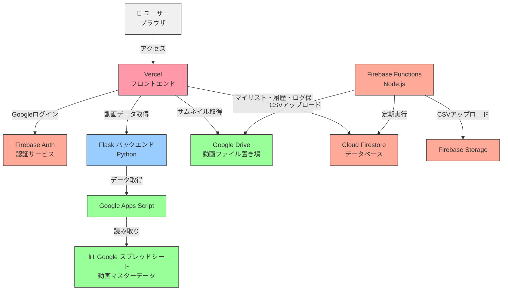
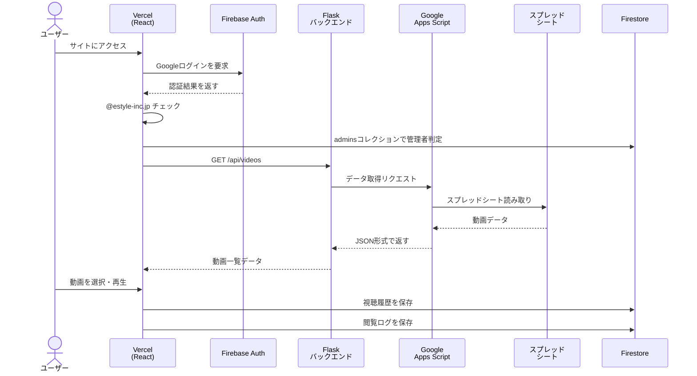

# E-FLIX 全体概要・システム構成

社内講義動画プラットフォーム「E-FLIX」の全体像をまとめたドキュメントです。  
**まずこのファイルを読めば、アプリ全体の構造が把握できます。**

---

## アプリの概要

| 項目 | 内容 |
|------|------|
| 目的 | 社内の講義動画をNetflix風UIで視聴できるプラットフォーム |
| 対象ユーザー | `@estyle-inc.jp` ドメインのGoogleアカウント保有者 |
| 管理者機能 | 閲覧ログのCSVダウンロード（Firestoreの `admins` コレクションで管理） |

---

## システム全体構成図

---

## ユーザー操作のデータフロー（シーケンス図）

---

## 技術スタック一覧

| レイヤー | 技術 | 役割 |
|----------|------|------|
| フロントエンド | React + Vite | UIの構築 |
| スタイリング | Tailwind CSS | デザイン |
| ホスティング | Vercel | フロントエンドの公開 |
| 認証 | Firebase Authentication | Googleログイン |
| データベース | Cloud Firestore | マイリスト・視聴履歴・閲覧ログ |
| バックエンド | Python Flask | 動画データのAPI |
| データ管理 | Google スプレッドシート + GAS | 動画マスターデータ |
| 動画ファイル | Google Drive | 動画の保存・再生 |
| バッチ処理 | Firebase Functions | 閲覧ログの定期CSV保存 |
| ストレージ | Firebase Storage | CSVファイルの保存 |
