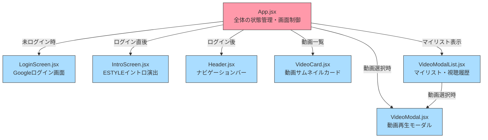

# フロントエンド解説

React + Vite で構築されたフロントエンドの詳細説明です。

---

## コンポーネント構成図



---

## 各コンポーネントの説明

### `App.jsx` — 司令塔
アプリ全体の「状態（state）」を管理し、どの画面を表示するか制御します。

**管理している主な状態：**
| state名 | 意味 |
|---------|------|
| `user` | ログイン中のユーザー情報 |
| `isAdminUser` | 管理者かどうか（Firestoreで判定） |
| `videos` | 取得した動画一覧 |
| `selectedVideo` | 選択中の動画（モーダル表示用） |
| `showMyList` / `showHistory` | マイリスト・視聴履歴モーダルの表示フラグ |
| `showIntro` | イントロ画面を表示するかどうか |

**画面の表示ロジック：**
```
ローディング中 → 「認証データをロード中...」
未ログイン    → LoginScreen
ログイン直後  → IntroScreen（2秒後にホームへ）
通常         → Header + 動画一覧 + 各モーダル
```

---

### `Header.jsx` — ナビゲーションバー
画面上部に固定表示されるバーです。

- カテゴリ切り替えボタン（PC: 横並び、スマホ: ドロップダウン）
- ユーザーアイコン → クリックでメニュー展開
  - ログアウト
  - マイリスト
  - 視聴履歴
  - 閲覧ログをダウンロード（管理者のみ表示）

---

### `VideoCard.jsx` — 動画カード
動画一覧の各カードです。

- サムネイル画像（Google Drive から自動取得）
- ハートアイコン → マイリストに追加
- 「詳細情報」ボタン → 詳細モーダルを開く
- カードクリック → 再生モーダルを開く

---

### `VideoModal.jsx` — 再生モーダル
動画を再生するモーダルウィンドウです。

- 「再生」ボタンを押すと `iframe` で Google Drive の動画を埋め込み再生
- 再生と同時に視聴履歴・閲覧ログをFirestoreに保存

---

### `VideoModalList.jsx` — マイリスト・視聴履歴
全画面モーダルでマイリストまたは視聴履歴を表示します。

- 「選択して削除」ボタンでチェックボックスが出現
- 選択した動画を削除できる
- 動画クリックで `VideoModal` を重ねて表示

---

### `LoginScreen.jsx` — ログイン画面
「Googleでサインイン」ボタンのみのシンプルな画面です。  
`@estyle-inc.jp` 以外のアカウントは弾かれます。

---

### `IntroScreen.jsx` — イントロ演出
ログイン後に2秒間だけ表示される「ESTYLE」のアニメーション画面です。

---

## 環境変数（`frontend/.env`）

| 変数名 | 用途 |
|--------|------|
| `VITE_FIREBASE_API_KEY` | Firebase接続キー |
| `VITE_FIREBASE_AUTH_DOMAIN` | Firebase認証ドメイン |
| `VITE_FIREBASE_PROJECT_ID` | FirebaseプロジェクトID |
| `VITE_FIREBASE_STORAGE_BUCKET` | Firebase Storageバケット名 |
| `VITE_FIREBASE_MESSAGING_SENDER_ID` | Firebase送信者ID |
| `VITE_FIREBASE_APP_ID` | FirebaseアプリID |
| `VITE_ALLOWED_DOMAIN` | ログインを許可するメールドメイン（`@estyle-inc.jp`） |
| `VITE_API_URL` | FlaskバックエンドのURL |

> ⚠️ `.env` ファイルは `.gitignore` で除外されているため GitHub には上がりません。  
> Vercelにデプロイする際は、Vercelダッシュボードの「Environment Variables」に同じ値を登録してください。
