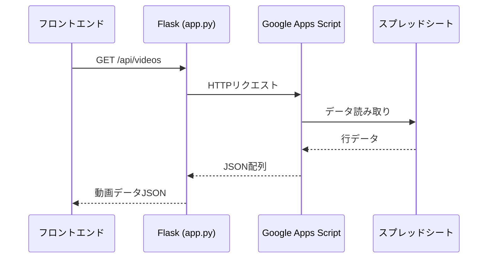
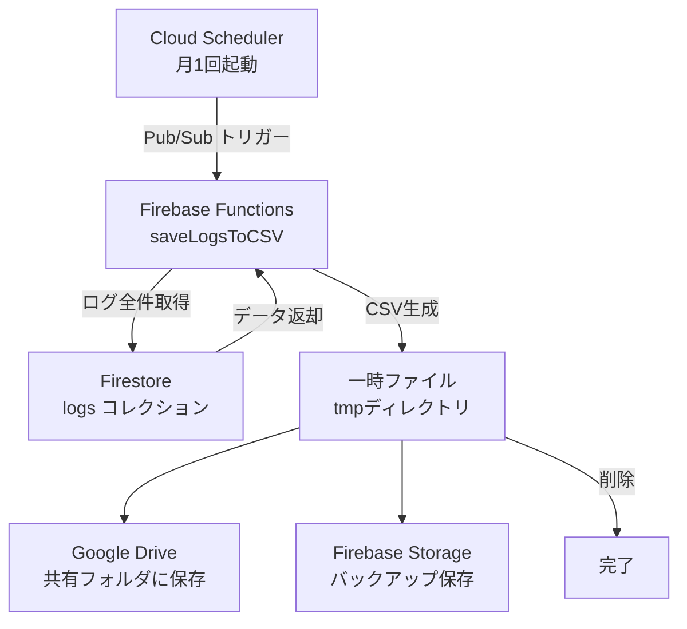

# バックエンド・Firebase Functions 解説

---

## Flask バックエンド（`backend/app.py`）

### 役割
Google スプレッドシートの動画データを、フロントエンドが使いやすいJSON形式で返すAPIサーバーです。

### データの流れ



### APIエンドポイント

| パス | メソッド | 説明 |
|------|---------|------|
| `/api/videos` | GET | 動画一覧を返す |
| `/` | GET | サーバー起動確認用 |

### 動画データの構造（1件分）
```json
{
  "title": "第1回：アジャイル開発とは何か？",
  "summary": "アジャイル開発の基本概念を学ぶ",
  "category": "開発",
  "expireDate": "2026-12-31",
  "driveLink": "https://drive.google.com/file/d/xxxx/preview",
  "thumbnail": "https://...",
  "description": "詳細な説明テキスト"
}
```

### 環境変数（`backend/.env`）

| 変数名 | 用途 |
|--------|------|
| `GAS_API_URL` | Google Apps ScriptのWebアプリURL |
| `FRONTEND_ORIGIN` | CORSで許可するフロントエンドURL |
| `FLASK_DEBUG` | デバッグモードの有効化（`true` / `false`） |

> ⚠️ ローカル開発時は `FRONTEND_ORIGIN=http://localhost:5173` に変更してください。

---

## Firebase Functions（`functions/index.js`）

### 役割
月1回、Cloud Schedulerによって自動起動し、Firestoreの閲覧ログをCSVにまとめて保存します。

### 処理フロー



### 環境変数（`functions/.env`）

| 変数名 | 用途 |
|--------|------|
| `DRIVE_CLIENT_ID` | Google OAuth2 クライアントID |
| `DRIVE_CLIENT_SECRET` | Google OAuth2 クライアントシークレット |
| `DRIVE_REFRESH_TOKEN` | Google OAuth2 リフレッシュトークン |
| `DRIVE_FOLDER_ID` | 保存先Google DriveフォルダのID |
| `STORAGE_BUCKET` | Firebase StorageバケットのURL |

> ⚠️ Firebase Functionsにデプロイする際は、Firebaseコンソールまたは  
> `firebase functions:config:set` コマンドで環境変数を設定してください。

### Cloud Scheduler 設定
- スケジュール: `0 9 1 * *`（毎月1日 午前9時）
- 設定場所: [Google Cloud Console → Cloud Scheduler](https://console.cloud.google.com/cloudscheduler?project=netflix-clone-course-39cf8)
