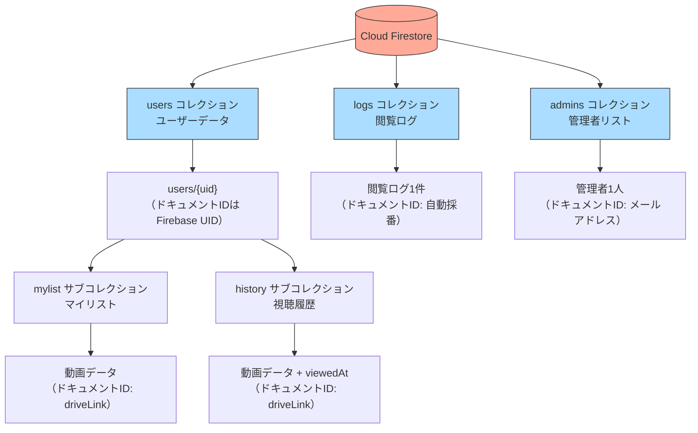

# Firestore データベース設計

---

## コレクション構成図



---

## 各コレクションの詳細

### `users/{uid}/mylist/{docId}` — マイリスト
ユーザーが「♡」ボタンで追加した動画を保存します。

```
users/
  wBj2oOeRVAfjwOHhIjbW2DHpsc13/   ← FirebaseのUID
    mylist/
      https%3A%2F%2Fdrive.google.com%2F...  ← URLエンコードされたdriveLink
        title: "第1回：アジャイル開発とは何か？"
        summary: "..."
        category: "開発"
        driveLink: "https://drive.google.com/..."
        thumbnail: "https://..."
        expireDate: "2026-12-31"
```

### `users/{uid}/history/{docId}` — 視聴履歴
動画の再生ボタンを押したときに保存されます。

```
users/
  wBj2oOeRVAfjwOHhIjbW2DHpsc13/
    history/
      https%3A%2F%2Fdrive.google.com%2F...
        title: "第1回：..."
        viewedAt: 2026-01-19T11:48:04Z  ← 視聴日時
        （動画データ全フィールド）
```

### `logs/{logId}` — 閲覧ログ
動画を再生するたびに追記されます。管理者がCSVでダウンロードできます。

```
logs/
  0HvDgEAQfWvz43AJuj7F/  ← 自動採番ID
    email: "y.tadami@estyle-inc.jp"
    uid: "wBj2oOeRVAfjwOHhIjbW2DHpsc13"
    videoTitle: "第1回：アジャイル開発とは何か？"
    videoSummary: "..."
    videoId: "https://drive.google.com/..."
    viewedAt: 2026-01-19T11:48:04Z
```

### `admins/{email}` — 管理者リスト
ドキュメントIDがメールアドレスそのものです。存在するかどうかで管理者判定します。

```
admins/
  t.ibi@estyle-inc.jp/
    role: "admin"
  y.tadami@estyle-inc.jp/
    role: "admin"
```

**管理者の追加・削除方法：**
Firebase Console → Firestore → `admins` コレクション でドキュメントを追加・削除するだけです。コードの変更は不要です。

---

## セキュリティルール

```javascript
rules_version = '2';
service cloud.firestore {
  match /databases/{database}/documents {

    // マイリスト（自分のデータのみ読み書き可）
    match /users/{userId}/mylist/{docId} {
      allow read, write: if request.auth != null && request.auth.uid == userId;
    }

    // 視聴履歴（自分のデータのみ読み書き可）
    match /users/{userId}/history/{docId} {
      allow read, write: if request.auth != null && request.auth.uid == userId;
    }

    // 管理者コレクション（自分のドキュメントのみ読み取り可）
    match /admins/{email} {
      allow read: if request.auth != null && request.auth.token.email == email;
    }

    // 閲覧ログ（書き込みは全員OK・読み取りは管理者のみ）
    match /logs/{logId} {
      allow write: if request.auth != null;
      allow read: if request.auth != null &&
        exists(/databases/$(database)/documents/admins/$(request.auth.token.email));
    }
  }
}
```
