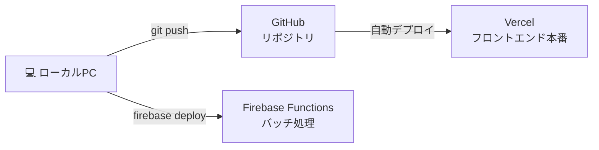

# デプロイ手順

コードを修正してから本番環境に反映するまでの手順です。

---

## デプロイ構成の全体像



---

## フロントエンドのデプロイ（GitHub → Vercel 自動）

### 通常の修正手順

```bash
# 1. ローカルで動作確認
cd frontend
npm run dev

# 2. ビルドエラーがないか確認
npm run build

# 3. GitHubにpush（Vercelが自動でデプロイ開始）
git add .
git commit -m "変更内容の説明"
git push origin main
```

Vercel の自動デプロイは push 後 **約2〜3分** で完了します。  
進捗は [Vercel ダッシュボード](https://vercel.com) で確認できます。

---

### ⚠️ 新しい環境変数を追加した場合

`.env` ファイルに新しい `VITE_` 変数を追加した場合は、**Vercel にも登録が必要**です。

1. [Vercel ダッシュボード](https://vercel.com) にログイン
2. プロジェクトを開く → **Settings → Environment Variables**
3. 新しい変数を追加
4. **再デプロイ**（Settings → Deployments → Redeploy）

---

## Firebase Functions のデプロイ（手動）

Firebase Functions は GitHub push では自動デプロイされません。  
`functions/index.js` を変更した場合は手動でデプロイが必要です。

```bash
# Firebase CLIをインストール済みの場合
cd e-flix-app
firebase deploy --only functions
```

---

## 動作確認チェックリスト

デプロイ後に以下を本番URL（`e-flix-frontend.vercel.app`）で確認してください：

- [ ] ログイン画面が表示される
- [ ] `@estyle-inc.jp` アカウントでログインできる
- [ ] 動画一覧が表示される
- [ ] カテゴリ切り替えが動く
- [ ] 動画を再生できる
- [ ] マイリストへの追加・表示ができる
- [ ] 視聴履歴が記録・表示される
- [ ] 管理者アカウントで「閲覧ログをダウンロード」が表示される

---

## 管理者の追加・削除

コードの変更は不要です。Firebase Console から直接操作します。

### 追加
1. [Firebase Console](https://console.firebase.google.com) → Firestore → `admins` コレクション
2. 「+ ドキュメントを追加」
3. ドキュメントID: 追加するメールアドレス（例: `new.user@estyle-inc.jp`）
4. フィールド: `role` / 種類: `string` / 値: `admin`
5. 「保存」

### 削除
1. `admins` コレクション → 対象のドキュメントをクリック
2. 右上の「⋮」→「ドキュメントを削除」

---

## 動画の追加・更新

動画データはコードではなく Google スプレッドシートで管理します。

1. スプレッドシートに新しい行を追加
2. 列（title / summary / category / expireDate / driveLink / thumbnail / description）を入力
3. アプリを開くと自動で反映される（再デプロイ不要）
