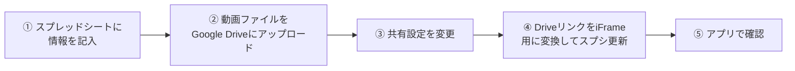

# 動画追加手順書

E-FLIXに新しい講義動画を追加するための手順書です。  
**コードの変更・デプロイは不要です。スプレッドシートへの記入だけで反映されます。**

---

## 全体の流れ



---

## Step 1: スプレッドシートに情報を記入

「動画メタデータ」スプレッドシートを開き、**最終行の下に新しい行を追加**します。

### 各列の説明

| 列名 | 必須 | 説明 | 例 |
|------|:----:|------|-----|
| `title` | ✅ | 動画のタイトル | `第5回：Transformerの仕組み` |
| `summary` | ✅ | 一覧画面に表示される短い説明（1〜2文） | `Attention機構の基礎から解説します` |
| `category` | ✅ | カテゴリ名（下記の選択肢から選ぶ） | `LLM` |
| `driveLink` | ✅ | Step 4 で変換した `/preview` URL | `https://drive.google.com/file/d/.../preview` |
| `expireDate` | ✅ | 視聴期限（ない場合は `なし` と記入） | `2027-03-31` または `なし` |
| `thumbnail` | | サムネイル画像のURL（空欄でも自動生成） | （空欄 or 画像URL） |
| `description` | | モーダル内の詳細説明（長文OK） | `この回では...` |

### カテゴリの選択肢

必ず以下のいずれかを**正確に**入力してください（スペース・全半角に注意）。

| 入力値 | 対応タブ |
|--------|---------|
| `LLM` | 生成AI / LLM |
| `ML` | 機械学習 |
| `DS` | データ分析 |
| `データ基盤` | データ基盤 |
| `開発` | エンジニアリング |
| `その他` | その他 |
| `視聴必須` | 🔰 視聴必須 |

> ⚠️ カテゴリが一致しない場合、「ALL」には表示されますが各カテゴリタブには表示されません。

### `expireDate` の入力形式

| 入力例 | 意味 |
|--------|------|
| `なし` | 期限なし（ずっと視聴可能） |
| `2027-03-31` | 2027年3月31日まで視聴可能 |

> ⚠️ 日付形式は必ず `YYYY-MM-DD` 形式で入力してください。

---

## Step 2: 動画ファイルを Google Drive にアップロード

1. 動画を保管しているGoogle Driveフォルダを開く
2. 追加したい動画ファイル（`.mp4` 推奨）をドラッグ&ドロップでアップロード
3. アップロード完了まで待つ

---

## Step 3: 共有設定を「リンクを知っている全員」に変更

アプリ内でiframeとして埋め込み再生するため、共有設定の変更が必要です。

1. アップロードしたファイルを右クリック → **「共有」**
2. 「リンクを知っている全員」に変更
3. 権限は **「閲覧者」** のまま
4. 「リンクをコピー」をクリックしてURLを控えておく

> コピーされるURLの例：  
> `https://drive.google.com/file/d/xxxxxxxxxxxxxxxxx/view?usp=sharing`

---

## Step 4: DriveリンクをiFrame埋め込み用に変換してスプシ更新

コピーしたURLの末尾を `/view?usp=sharing` から `/preview` に書き換え、Step 1 で記入した `driveLink` 列に貼り付けます。

| 変換前 | 変換後 |
|--------|--------|
| `.../file/d/ファイルID/view?usp=sharing` | `.../file/d/ファイルID/preview` |

**例：**
```
変換前: https://drive.google.com/file/d/1abc123XYZ/view?usp=sharing
変換後: https://drive.google.com/file/d/1abc123XYZ/preview   ← これをスプシの driveLink 列に記入
```

---

## Step 5: アプリで確認

スプレッドシートへの記入後、アプリ（`e-flix-frontend.vercel.app`）を**リロード**するだけで反映されます。

チェックポイント：
- [ ] 動画一覧に新しい動画が表示される
- [ ] 正しいカテゴリタブに表示される
- [ ] サムネイルが表示される（空欄の場合はDriveから自動生成）
- [ ] 再生ボタンを押すと動画が再生される
- [ ] 視聴期限が正しく表示される

---

## よくあるミスと対処法

| 症状 | 原因 | 対処 |
|------|------|------|
| 動画が再生されない | Driveリンクがpreviewになっていない | Step 4 のURL変換を確認 |
| 動画が再生されない | Google Driveの共有設定が非公開 | Step 3 の共有設定を確認 |
| カテゴリタブに表示されない | カテゴリ名が一致していない | 全角/半角・スペースを確認 |
| サムネイルが表示されない | （正常）DriveリンクからURLを自動生成中 | しばらく待つかページをリロード |
| 視聴期限の表示がおかしい | 日付形式が違う | `YYYY-MM-DD` 形式で再入力 |
