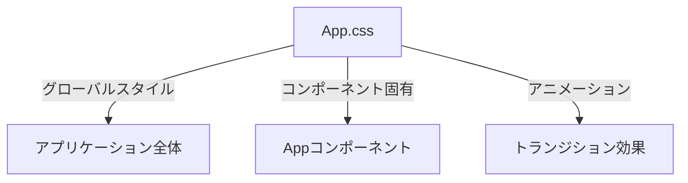
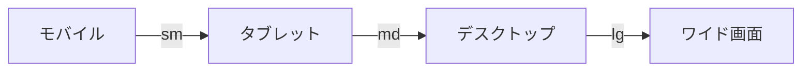

# App.css 解説ドキュメント

## 1. スタイル構造


## 2. 主要スタイル定義
```css
.app {
  min-height: 100vh;
  background-color: theme('colors.e-flix.secondary');
}

.hero-section {
  position: relative;
  height: 80vh;
  background-size: cover;
  background-position: center;
}

.video-grid {
  display: grid;
  gap: 1.5rem;
  grid-template-columns: repeat(auto-fill, minmax(250px, 1fr));
}
```

## 3. アニメーション定義
```css
@keyframes fadeIn {
  from { opacity: 0; }
  to { opacity: 1; }
}

.fade-enter {
  animation: fadeIn 0.3s ease-in;
}

/* イントロ画面 ESTYLEロゴのフェードインアニメーション */
.animate-estyle-fade {
  animation: estyleFadeIn 1.4s cubic-bezier(0.4,0,0.2,1);
}
@keyframes estyleFadeIn {
  0% {
    opacity: 0;
    transform: scale(0.95);
    letter-spacing: 0.4em;
  }
  60% {
    opacity: 1;
    transform: scale(1.05);
    letter-spacing: 0.12em;
  }
  100% {
    opacity: 1;
    transform: scale(1);
    letter-spacing: 0.15em;
  }
}
```

## 4. レスポンシブデザイン


## 5. コンポーネントスタイル
```css
/* ハートボタン */
.heart-btn {
  @apply p-2 rounded-full border border-red-600 bg-black/60 hover:bg-red-600 transition-colors duration-200 flex items-center justify-center;
}
.heart-btn .lucide-heart {
  @apply text-red-600;
}
```