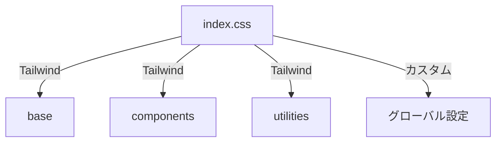

# index.css 解説ドキュメント

## 1. 基本構造


## 2. Tailwindディレクティブ
```css
@tailwind base;
@tailwind components;
@tailwind utilities;

/* グローバルスタイル */
:root {
  --primary-color: #E50914;
  --background-color: #141414;
}

body {
  @apply bg-black text-white;
}
```

## 3. カスタムユーティリティ
```css
@layer utilities {
  .text-shadow {
    text-shadow: 2px 2px 4px rgba(0,0,0,0.5);
  }
}
```