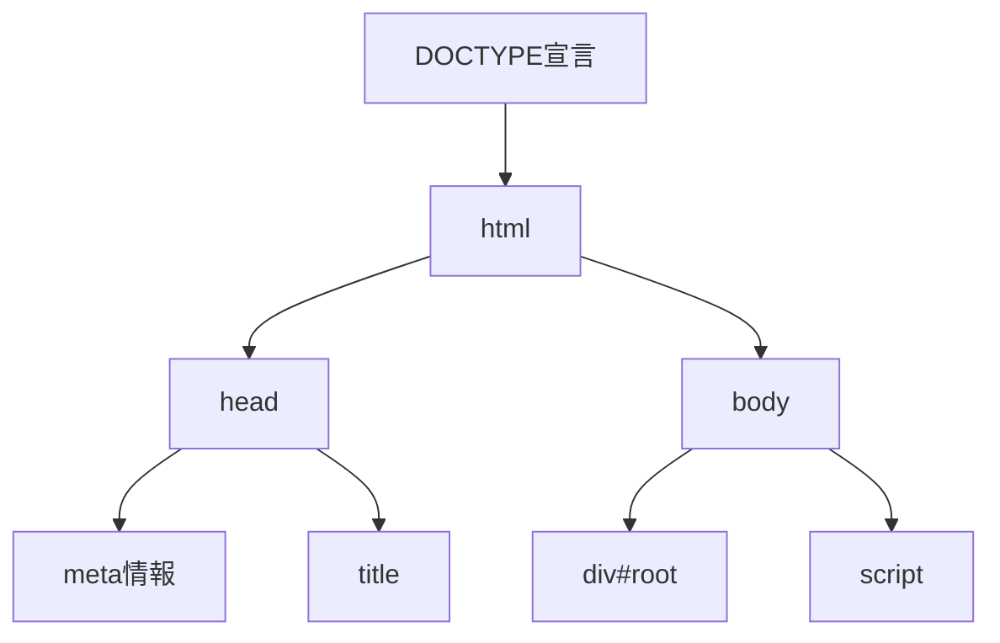
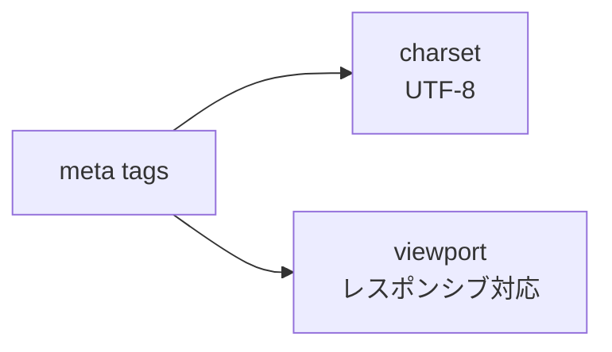
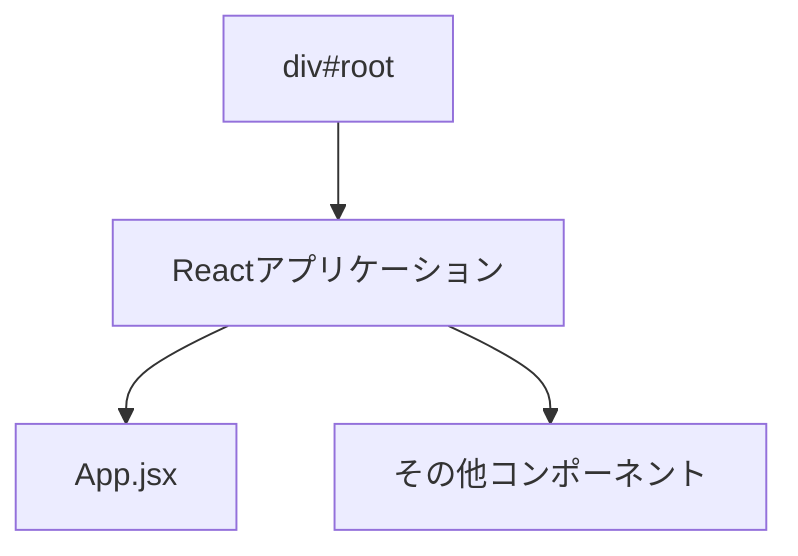
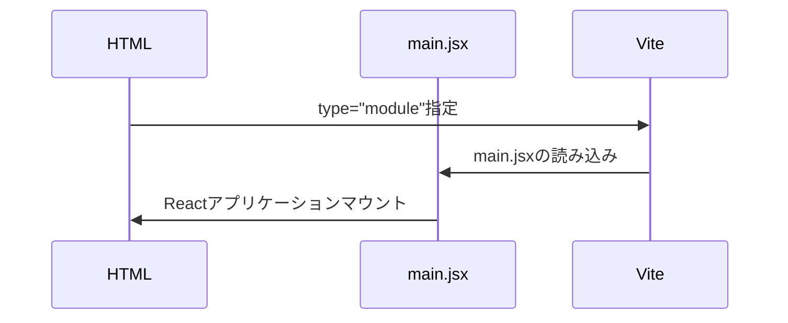
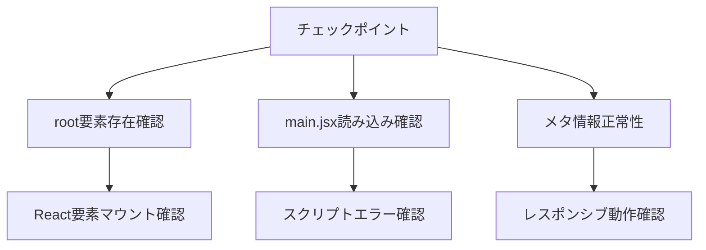

# index.html 解説ドキュメント

## 1. 基本構造


## 2. ファイル構成

### HTML基本構造
```html
<!DOCTYPE html>
<html lang="ja">
  <head>
    <meta charset="UTF-8" />
    <meta name="viewport" content="width=device-width, initial-scale=1.0" />
    <title>E-FLIX</title>
  </head>
  <body>
    <div id="root"></div>
    <script type="module" src="/src/main.jsx"></script>
  </body>
</html>
```

## 3. 重要ポイント解説

### メタ情報


1. charset="UTF-8"
   - 文字エンコーディング指定
   - 日本語表示に必須

2. viewport設定
   - モバイル対応
   - デバイス幅に合わせた表示

### Reactマウントポイント


### スクリプト読み込み


## 4. Viteとの連携ポイント

### 開発時の動作
1. Viteサーバー起動
2. モジュール型としてスクリプト読み込み
3. HMR（ホットモジュールリローディング）有効化

### ビルド時の最適化
1. アセットのバンドル
2. コード分割
3. キャッシュバスティング

## 5. デバッグチェックポイント

### 要確認項目


## 6. よくあるエラーと対処法

### 1. ホワイトスクリーン
- 原因：root要素不在またはスクリプト読み込みエラー
- 確認：開発者ツールのコンソール
- 対処：
  - divタグのid確認
  - スクリプトパス確認

### 2. レスポンシブ非対応
- 原因：viewport設定不備
- 確認：スマートフォンでの表示
- 対処：metaタグの確認

### 3. 文字化け
- 原因：文字エンコーディング設定ミス
- 確認：日本語表示
- 対処：charset指定確認

## 7. セキュリティ考慮事項

### CSP (Content Security Policy)
```html
<meta http-equiv="Content-Security-Policy" 
      content="default-src 'self' https://apis.google.com">
```
- スクリプト実行制御
- リソース読み込み制御
- XSS対策