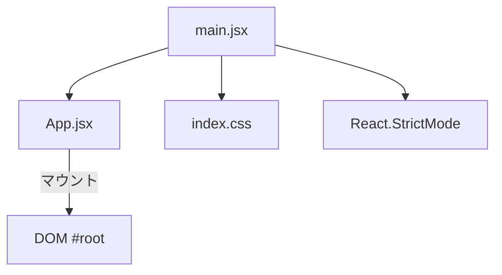
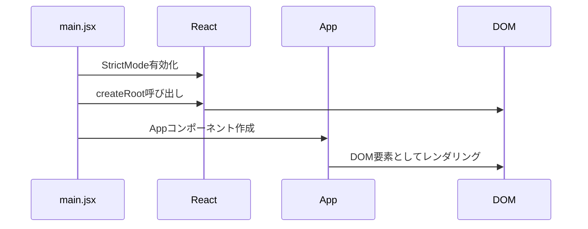
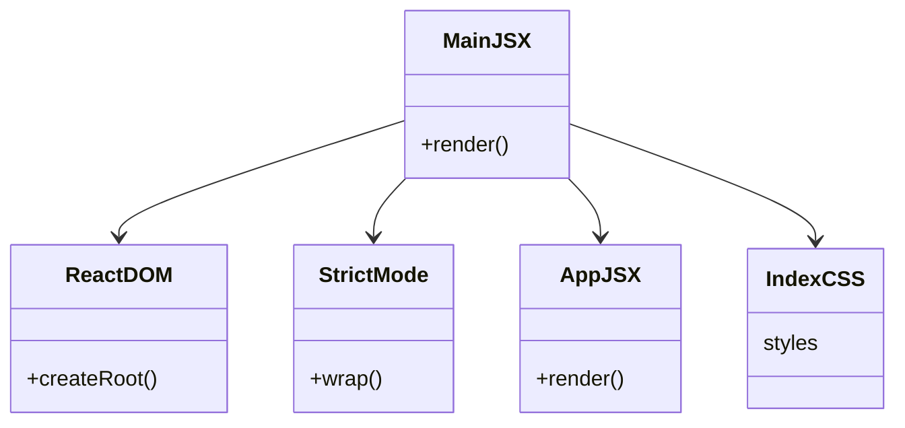

# main.jsx 解説ドキュメント

## 1. エントリーポイントの役割

- Reactアプリの起動ファイル
- App.jsx（メイン画面）を#rootにマウント
- Tailwind CSSのスタイルを全体に適用
- StrictModeで開発時のバグ検出を強化

---

## 2. ファイル構成と流れ

## 3. 初期化フロー

## 4. 重要ポイント

### StrictModeの役割
- 開発時の潜在的な問題の検出
- 安全でない lifecycles の検出
- レガシーな API 使用の警告
- 副作用の二重実行によるバグ検出

### レンダリングプロセス
1. #root 要素の取得
2. React ルートの作成
3. StrictMode でのラップ
4. App コンポーネントのマウント

## 5. 依存関係図

## 6. デバッグポイント

### 開発環境での動作
- StrictMode による二重レンダリング
- コンポーネントのマウント確認
- CSS の適用確認

### よくあるエラー
1. #root 要素不在
   - index.html の確認
2. App コンポーネントのインポートエラー
   - パス指定の確認
3. CSS 読み込みエラー
   - ビルド設定の確認

## 7. Viteとの関係

### 開発サーバー
- デフォルトポート: 5173
- HMR (Hot Module Replacement) 対応
- ソースマップ対応

### ビルド時の最適化
- Tree-shaking
- コード分割
- アセット最適化