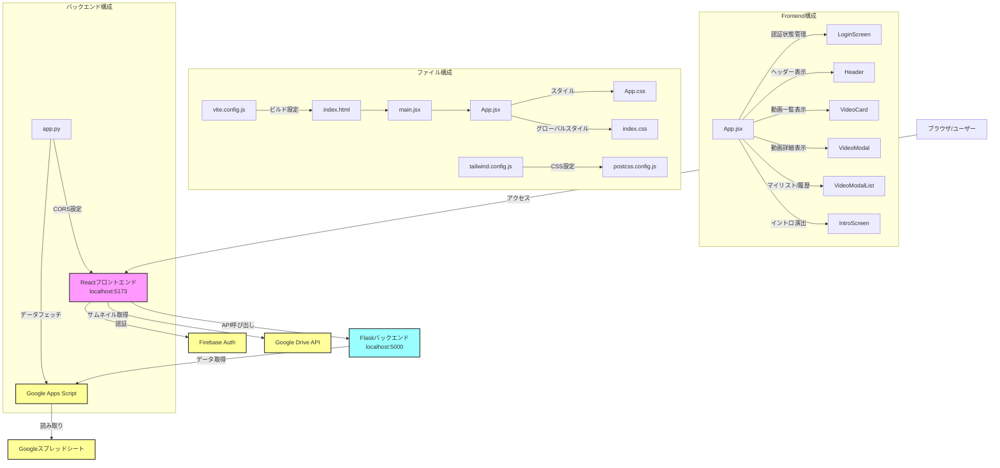
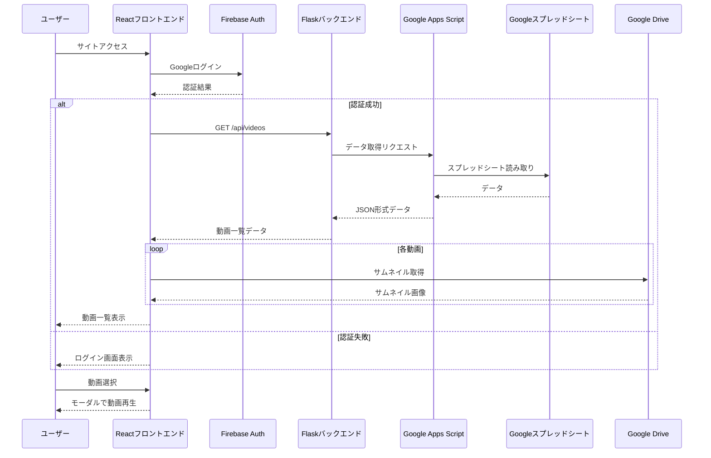

# E-FLIX システム全体構成・処理フロー図

このドキュメントは、E-FLIXアプリの全体像・構成・データの流れ・各ファイルやサービスのつながりを一目で理解できるようにまとめています。  
**この1ファイルを見れば、E-FLIXの「どこで何が動き、どう連携しているか」が分かります。**

---

## 1. システム全体構成図

このMermaid図は以下を表現しています：

1. 全体のシステム構成図（上部）
   - ユーザーからGoogleスプレッドシートまでのデータフロー
   - フロントエンド、バックエンド、外部サービスの関係

2. フロントエンドの詳細構成（中部）
   - App.jsxを中心としたコンポーネント構成
   - 各ファイルの依存関係

3. シーケンス図（下部）
   - ユーザーアクションから始まる一連の処理フロー
   - 認証からデータ表示までの時系列的な流れ

色分けによる分類：
- フロントエンド（ピンク系）
- バックエンド（水色系）
- 外部サービス（黄色系）