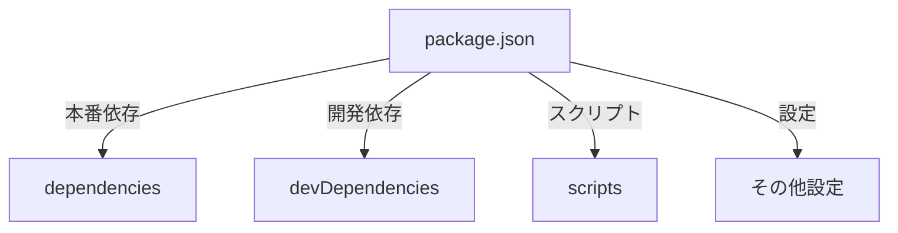
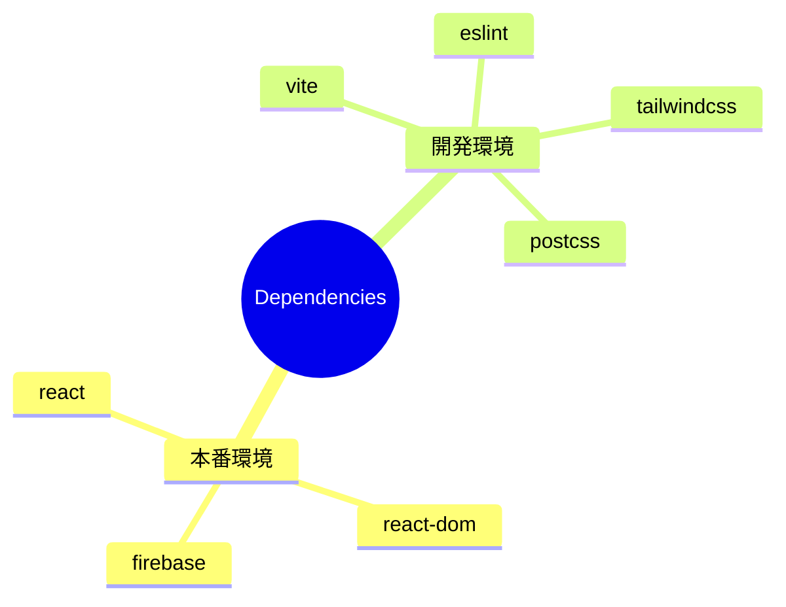

# package.json 解説ドキュメント

## 1. 依存関係構造


## 2. 主要設定
```json
{
  "name": "e-flix-frontend",
  "private": true,
  "version": "0.0.0",
  "type": "module",
  "scripts": {
    "dev": "vite",
    "build": "vite build",
    "lint": "eslint . --ext js,jsx --report-unused-disable-directives --max-warnings 0",
    "preview": "vite preview"
  }
}
```

## 3. 依存関係マップ
