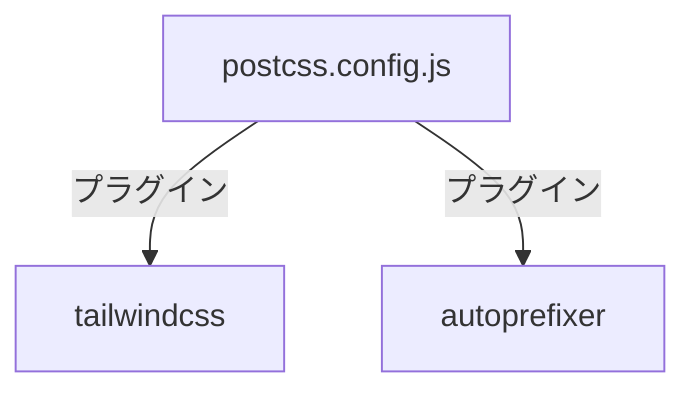
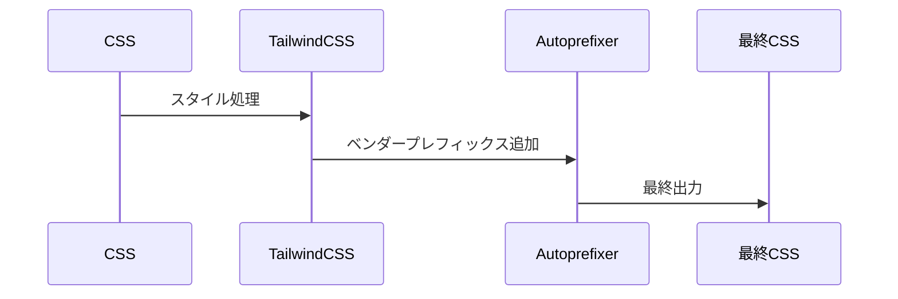

# postcss.config.js 解説ドキュメント

## 1. 設定構造

```mermaid
graph TD
    A[postcss.config.js] -->|プラグイン| B[tailwindcss]
    A -->|プラグイン| C[autoprefixer]
```

## 2. 基本設定
```javascript
export default {
  plugins: {
    tailwindcss: {},
    autoprefixer: {},
  },
}
```

## 3. プラグインフロー

```mermaid
sequenceDiagram
    participant CSS as CSS
    participant Tailwind as TailwindCSS
    participant Autoprefixer as Autoprefixer
    participant Final as 最終CSS

    CSS->>Tailwind: スタイル処理
    Tailwind->>Autoprefixer: ベンダープレフィックス追加
    Autoprefixer->>Final: 最終出力
```