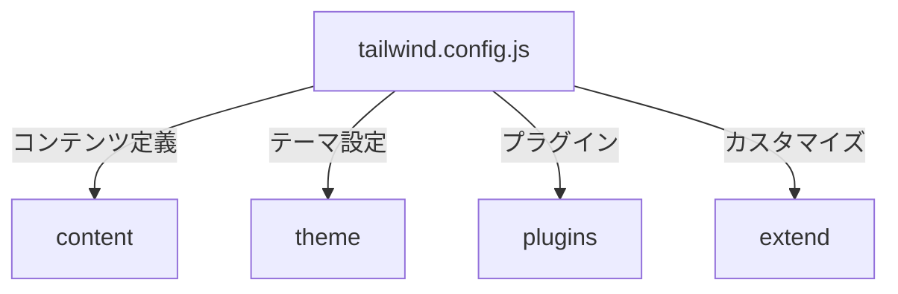
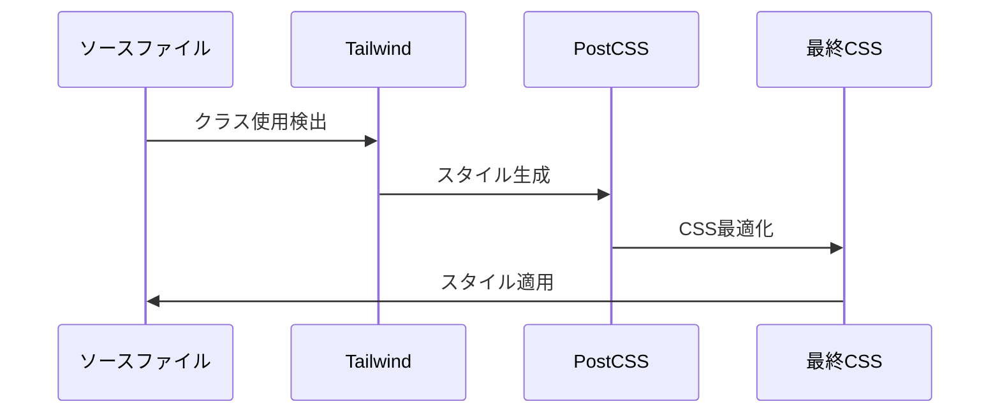
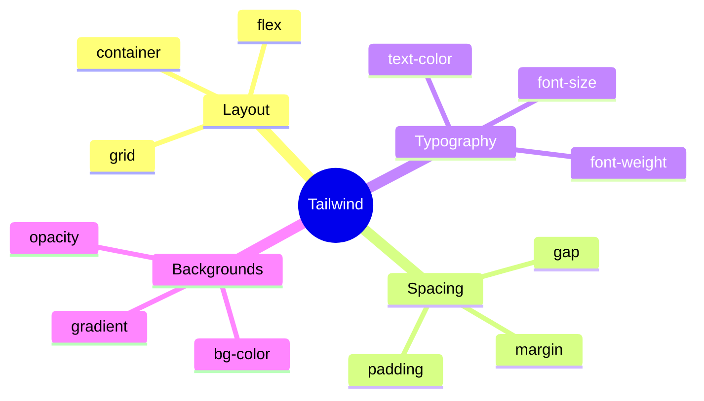
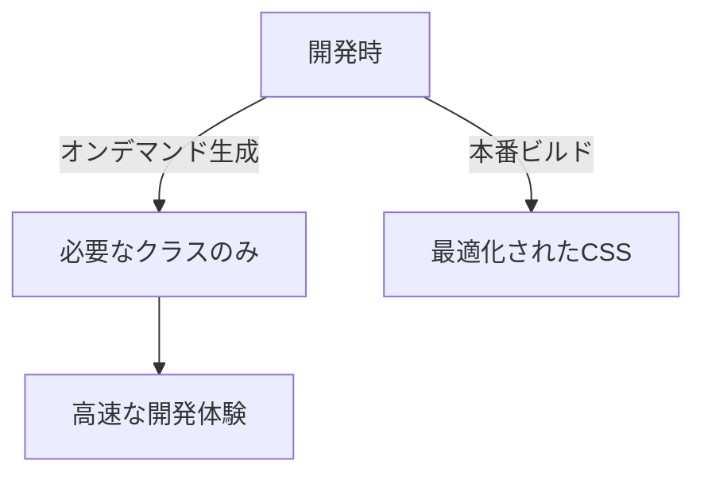
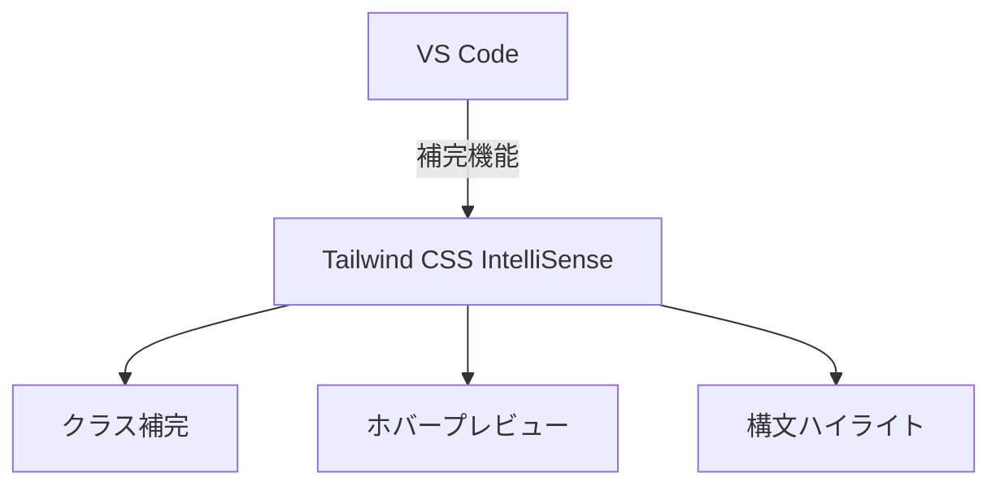

# tailwind.config.js 解説ドキュメント

## 1. 設定概要


## 2. 基本設定

### 設定ファイル構造
```javascript
/** @type {import('tailwindcss').Config} */
export default {
  content: [
    "./index.html",
    "./src/**/*.{js,ts,jsx,tsx}",
  ],
  theme: {
    extend: {},
  },
  plugins: [],
}
```

## 3. スタイル適用フロー



## 4. カスタマイズ設定

### テーマ拡張例
```javascript
theme: {
  extend: {
    colors: {
      'e-flix': {
        primary: '#E50914',
        secondary: '#141414',
        accent: '#FFFFFF',
      }
    },
    fontFamily: {
      sans: ['Noto Sans JP', 'sans-serif'],
    }
  }
}
```

## 5. レスポンシブデザイン

### ブレークポイント設定


## 6. ユーティリティクラス

### よく使用するクラス


## 7. パフォーマンス最適化

### JIT（Just-In-Time）モード


## 8. デバッグとトラブルシューティング

### よくある問題と解決策
1. スタイルが適用されない
   - content配列のパス確認
   - PostCSS設定の確認
   - キャッシュのクリア

2. カスタム設定が反映されない
   - 設定ファイルの構文確認
   - extend内の配置確認
   - 開発サーバーの再起動

3. ビルド時の最適化問題
   - purge設定の確認
   - safelist の確認
   - node_modules の再インストール

## 9. VS Code 連携

### 推奨拡張機能
```json
{
  "recommendations": [
    "bradlc.vscode-tailwindcss",
    "csstools.postcss",
    "kokororin.vscode-phpfmt"
  ]
}
```

### インテリセンス設定


## 10. セキュリティと最適化

### プロダクション設定
```javascript
module.exports = {
  mode: 'jit',
  purge: {
    enabled: process.env.NODE_ENV === 'production',
    content: [
      './src/**/*.{js,jsx,ts,tsx}',
      './public/index.html'
    ],
    options: {
      safelist: []
    }
  }
}
```