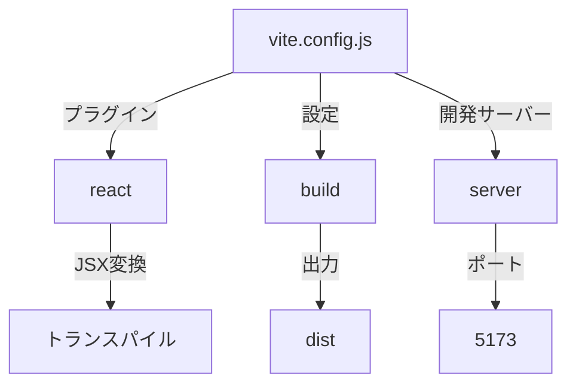
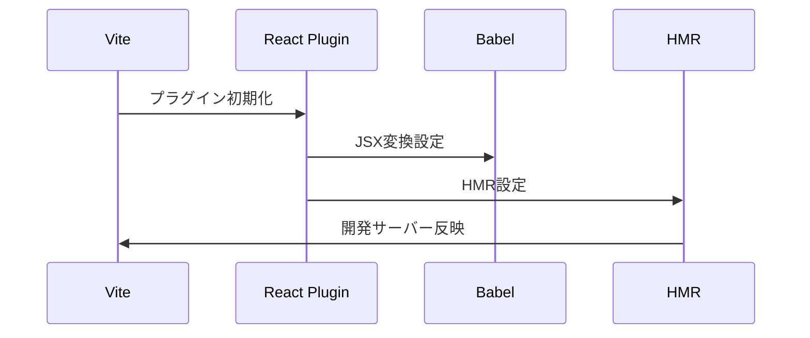
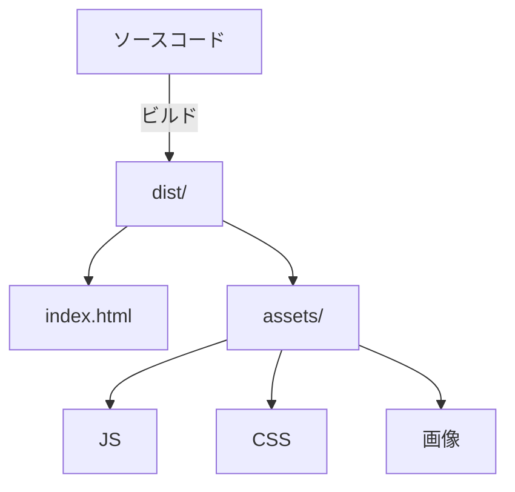
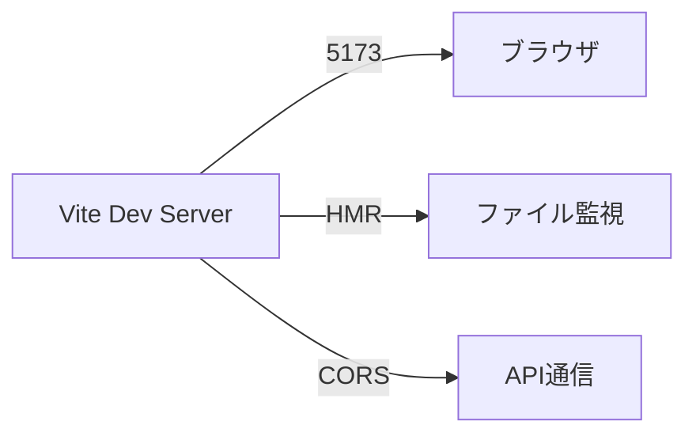
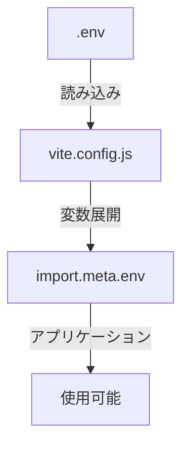
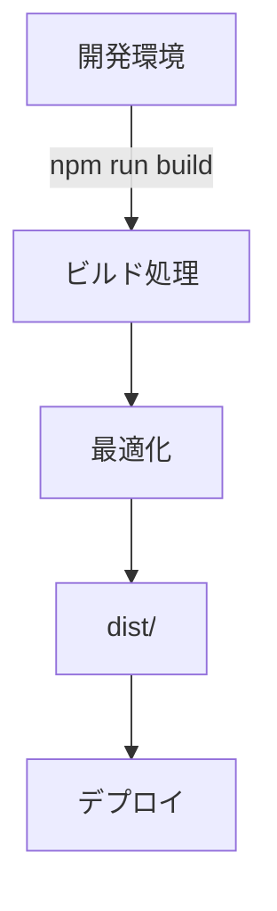

# vite.config.js 解説ドキュメント

## 1. 設定構造


## 2. 基本設定

### 設定ファイル構造
```javascript
import { defineConfig } from 'vite'
import react from '@vitejs/plugin-react'

export default defineConfig({
  plugins: [react()],
  server: {
    port: 5173,
    strictPort: true
  },
  build: {
    outDir: 'dist',
    assetsDir: 'assets'
  }
})
```

## 3. プラグインシステム

### React設定フロー


## 4. ビルド設定オプション

### ビルド出力構造


## 5. 開発サーバー設定

### サーバー構成


## 6. 環境変数設定

### 環境変数フロー


## 7. パフォーマンス最適化

### ビルド最適化設定
```javascript
{
  build: {
    minify: 'terser',
    rollupOptions: {
      output: {
        manualChunks: {
          vendor: ['react', 'react-dom']
        }
      }
    },
    chunkSizeWarningLimit: 500
  }
}
```

## 8. よくあるトラブルシューティング

### 1. HMRが機能しない
- 原因：
  - プラグイン設定ミス
  - ファイル監視設定の問題
- 対処：
  - プラグインの再確認
  - server.watchOptions の確認

### 2. ビルドエラー
- 原因：
  - 依存関係の問題
  - パス解決の失敗
- 対処：
  - node_modules の削除と再インストール
  - resolve.alias の確認

### 3. 環境変数が読み込めない
- 原因：
  - .env ファイルの配置ミス
  - 変数名のプレフィックス不足
- 対処：
  - VITE_ プレフィックスの確認
  - envDir 設定の確認

## 9. プロダクション対応

### デプロイメント準備


### チェックリスト
1. 環境変数の設定
2. ベースパスの確認
3. SSR対応の確認
4. キャッシュ設定
5. CSP対応